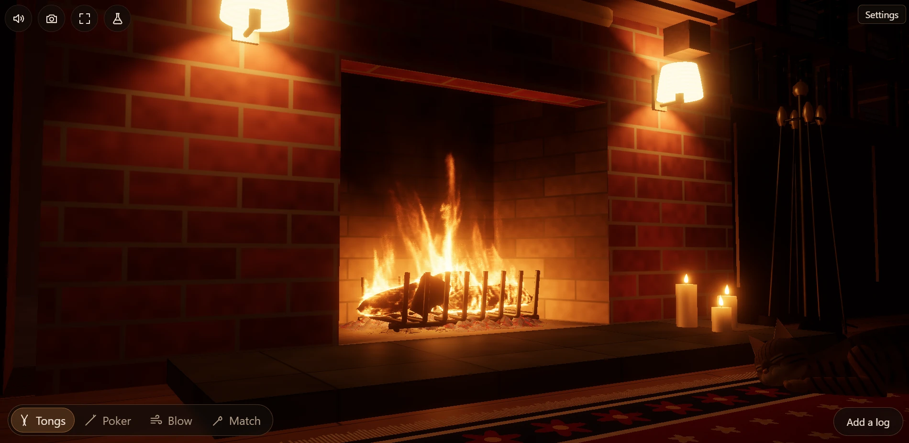
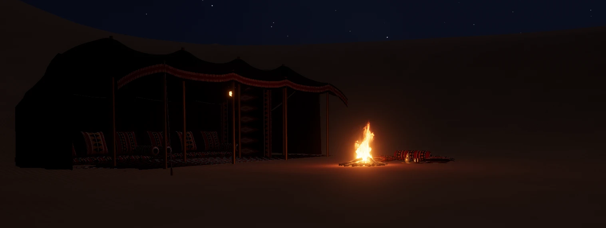

# Fireplace

A cozy, interactive fireplace in the browser. The fire is a real-time simulation on the GPU
(WebGPU): logs heat up, dry out, char and burn down to ash; the gas they give off burns in the
air above them; and what you see is the glow of hot soot, char and coals. You can rearrange the
logs with tongs, knock them about with a poker, blow on the coals, or lay a fire cold and light
it yourself with a match, and you hear it all. Left alone, a fire burns down over the evening
to a bed of embers glowing under their ash. Sit by a brick hearth in a sitting room lined
with books, in a Spanish hacienda, at a campfire in a mountain meadow in the Cascades with
Mount Rainier on the horizon, where fireflies blink in the dark and an owl calls, or at a
Bedouin camp in the dunes, with a kettle on the embers; and look up at the real night sky over
it.

**Light it: [ohinai.github.io/fireplace](https://ohinai.github.io/fireplace/)** (in a browser
with WebGPU: see *Publishing it* below for which).





## Run it

```bash
npm install
npm run dev
```

Open http://localhost:5173 in a browser with WebGPU (see *Publishing it* below for which).
`npm run build` produces a static site in `dist/`.

**The main page:** a first visit opens on a page with a picture of each place to sit (the brick
hearth, the hacienda, the campfire, the desert camp) and a few words on what it does and how it
works; choose one and the fire lights there, its sound starting with the same click. After that
it goes straight to the place chosen last. The house button at the top left brings the main page
back over the fire, which burns on behind it: choose the same place again (or *Back to the fire*,
or `Esc`) to go back to it, or another for a new fire there. The browser's Back and Forward go
between the two. The pictures on it (`src/pictures`) are rendered by the fireplace itself, at
High quality with Full detail. A browser without WebGPU gets the main page too, saying what the
fire needs.

**Controls:** **Add a log** (or `L`) puts a log (or, with Wood set to Kindling, a stick of
kindling) on the fire: up to twenty pieces, as many as fit (a fireplace's grate or andirons take
ten to fifteen before the pile nears the lintel; a campfire, once there is no room left to stand
another log up round it, takes them laid across the top). Pick a tool at the bottom left (or
press `1` to `4`):

- **Tongs:** drag a log to pick it up and move it; let go to drop it. The tongs take hold
  gently and carry it steadily, lifting it clear of the pile. While holding it, the wheel (or
  `W`/`S`) moves it back and forth, and Shift+wheel (or `Q`/`E`) turns it; on a touch screen,
  buttons for both appear while you hold a log.
- **Poker:** drag to push logs about, click to jab. A jab or a knock breaks a log that has burnt
  thin. Rake it through the coals under the grate to stir them up.
- **Blow:** drag across the coals to blow on them.
- **Match:** press to strike a long match and hold it where you point; let go to blow it out.
  Held to a firelighter for a moment, it lights it. It burns for half a minute.

Right-drag (or two fingers) looks around (all the way round the campfire); the wheel (or
pinching) zooms. Furniture (or the tent) that comes between you and the fire as you look round
fades away until you have passed it, so nothing ever hides the fire. The round buttons at the
top left: the house goes to the main page; the speaker (or `M`) turns the sound on and off
(browsers start it on your first click); the camera (or `V`) glides to the next view; the frame (or `H`) hides every control, for
just the fire: move the pointer (or tap) and a small button comes up to bring them back, or press
`H` or `Esc`; the flask (or `X`) opens **Science** (see below).

`Settings` has the main things first:

- **Room**, and the **View**: ways of looking at the fire. Indoors: in front, close up, at hearth
  level, from the armchair, the whole room. Outdoors: by the fire, close up, from where you would
  sit, the whole meadow or the dunes, and *Stargazing*: lying back looking up (drag, with any
  button, to look about; the wheel narrows or widens the view).
- **Fire:** *Already burning* starts you with logs well alight on a bed of coals in a warm
  fireplace. *Laid cold: light it* lays a fresh, unlit fire with kindling and a firelighter at
  each end, in a cold fireplace: light one end (or both) with the match. **Wood:** what *Add a
  log* puts on.
- **Lamps** dims the room's lamps up and down (wall lights with fabric shades by the brick
  hearth, iron lanterns in the hacienda, a hurricane lantern at the campfire and at the tent); a
  dimmed bulb turns redder as well as dimmer. **Candles** lights or puts out the candles.
  **Outside** is the time of day: night (moonlight and stars outdoors), dusk (blue light through
  the windows, the last glow in the sky) or daytime.
- **Moon** and **Stars** (outdoors): the Moon *as tonight* or *left out* (for the darkest sky,
  with the Milky Way at its best); the stars *as they are* or with the constellations drawn and
  named. **Kettle:** set a kettle of water down by the fire (on a trivet beside the logs in a
  fireplace, on the embers outdoors) and watch it come to the boil, steam and bubble.
- **Volume.**

and the rest under **More settings**:

- **The picture:** brightness, colour (from grey to rich), glow, sparks, heat haze, and
  (outdoors) **Starlight**: how much the stars and the Milky Way are brought out, from 0 (as the
  eye would see them: few stars by moonlight) up; it starts well up, for a sky full of stars.
  **Edges:** smoothed (anti-aliasing, by FXAA: the stair steps along the edges of the logs,
  the grate and the furniture blended away) or left sharp.
- **Quality:** the size of the air's grid: **Low**, for phones and weak graphics cards (a coarse
  grid of 15 mm cells, a small picture scaled up to the screen, thirty frames a second, and the
  insides of the logs worked out every fourth step: about a tenth of the work of Medium; phones
  start on it; the flames are drawn with detail finer than the grid, in tongues carried along
  with the gas, as a coarse grid smears a flame's thin sheets into glowing blobs, sampled at
  fixed places so that they show no grain; and its fire is calibrated to a fine grid's, since
  a coarse one burns its wood gas in flames two to four times too big: more mixing, less soot,
  more cooling, gentler confinement, and the light a fine grid's fire gives), Medium, High,
  or **Ultra**, for the fastest graphics cards there are and those to come: nearly eight million cells, 3 mm across in a
  fireplace (seven times High's), with the flames drawn through a smooth filter, so that even
  close up no trace of the grid shows in them; sharp on a 4K screen. It takes about a gigabyte
  of graphics memory and runs the fire in slow motion on all but the fastest cards; if there is
  not the memory for it, the quality goes back to what it was. The quality is picked for your
  graphics card to start with (never Ultra). **Detail:** how much there is round the fire: *Simple* (the fireplace and
  little else), *Furnished* or *Full* (more furniture and ornaments, more trees). Less is quicker
  to draw; the fire is the same.

**Start over** lays a new fire; **Reset settings** puts every setting back to how it started,
Science too (the room and the fire you have stay as they are). Settings are remembered from one
visit to the next (a slider only if you moved it; Science is not: each visit starts on Earth).
**Credits** are at the foot of the panel, with a link for giving to the Palestine Children's
Relief Fund ([pcrf.net/donate](https://www.pcrf.net/donate)).

**Science** (the flask) shows the fire's workings and lets you change its physics:

- **Show:** the fire as it is, or one of its workings: **Wood moisture** colours every log by
  how wet it is (bone dry to sodden, with a key) and puts a reading on each; the cut ends show
  the wet core and the dry rim. Or the air's temperature, fuel, oxygen used, soot, speed, smoke.
  While any of these (or an overlay) shows, the kettle's temperature floats over it.
- **Grid** and **Airflow:** a slice through the fire (across it, or along it, whichever faces
  you; **Slice** moves it from back to front) showing the grid of cells the air is worked out on
  (a line every few cells, the box it fills outlined), the cells it takes to be solid (the wood
  in orange, walls and stones in grey: the logs as the air sees them, in steps), and arrows for
  the air's flow across the slice, longer the faster it goes, from blue (still) through green
  and yellow to red (3 m/s).
- **Gravity:** Earth, the Moon, Mars, Jupiter or weightless in orbit, or anything from 0 to 25
  m/s². It drives the hot air's rise, the chimney's draw, the logs' fall, the sparks' drop and
  the steam's rise. Weightless, nothing rises: the flames shrink to dim glows round the logs,
  fed only as the gas mixes (as a candle flame in orbit is a small, round, blue ball).
- **The air:** lift (buoyancy), swirl (vorticity confinement), flicker (sub-grid turbulence),
  drag (how fast motion dies away, in place of viscosity), draft (fireplaces), expansion (how
  much burning gas swells).
- **Burning:** time (a time-lapse), burn rate, ignition temperature, heat released, air needed,
  soot made and burnt off, radiative cooling, how strongly the flames' radiation heats the logs,
  smoke made and how fast it thins.
- **The wood:** how wet the wood is, as it comes or from bone dry (5%) to green (60% water for
  its dry weight). It takes at once, in the logs on the fire: the water left in each is scaled,
  so whatever the fire has already dried (the char, the dried rim) stays dry and the wood inside
  takes the new moisture (a burning log then reads a little under the setting). The logs you lay
  with Start over, or put on, are that wet right through. Kindling is kept dry.
- **Readings:** the grid, the power the flames radiate, the coals, the pieces of wood on the
  fire, an estimate of the CO₂ the fire has given off (so far, and at the rate it burns now:
  from the carbon in the wood gas, the char and the firelighters it has burnt; dry wood is about
  half carbon, and each kilogram of carbon makes 3.7 kg of CO₂), the kettle, gravity, frames a
  second. **Back to Earth** puts all of it back. Add `?quality=low|medium|high|ultra` to the URL to skip
automatic quality selection, `?room=` to go straight to a room (past the main page) and
`?fire=cold` to start with a cold fire. (The address names a room only when it came with one:
otherwise it stays the site's own, so that sharing it shares the main page.)

**Rooms** (on the main page, Settings → Room, or `?room=brick|hacienda|campfire|desert`):

- **Brick hearth:** a sooty firebrick firebox in a chimney breast of old brick, logs on a basket
  grate, pillar candles on the hearth and wall lights either side: oak, birch, pine or damp
  wood. Furnished: bookshelves in the alcoves either side, a mantel clock (it keeps the real
  time), brass candlesticks and books on the mantel, a painting above, the fire irons and a
  wicker basket of split logs by the hearth, a Persian rug, and a wingback armchair drawn up
  to the fire. Full: a side table with a mug of tea, a brown tabby asleep on the rug by the hearth, stretched out with its chin on
  the floor and a paw out (breathing),
  a fiddle-leaf fig.
- **Hacienda:** a whitewashed chimney breast with an arched opening framed in hand-painted
  Talavera tiles, a hewn beam mantel on corbels and a hood up to the ceiling. The fire sits
  up on a raised, tiled hearth, on a pair of Spanish iron andirons (morillos), in a firebox of
  hand-plastered adobe, its back corners rounded and a cove where the walls meet the floor, the
  clay reddened low down, blackened with soot above, cracked here and there. Clay pots,
  candles and spare firewood are on the hearth; a kilim (a lattice of stepped diamonds on a
  madder-red field) lies on the wooden floor, and a candle burns in a niche in the wall.
  Furnished: a santo in the niche, Talavera plates on the wall, ristras of red chiles hanging
  from the beams, a basket of piñon kindling, an equipal (a pigskin chair). Full: agaves in pots.
  Burns holm oak (encina), olive, mesquite or piñon.
- **Campfire:** a ring of field stones in a subalpine meadow in the Cascades, logs stood up in
  a teepee, a fallen log to sit on with tea lights in glass on it, a hurricane lantern on a
  stump, a stack of split wood. The meadow is open to the sky: islands of firs and hemlocks
  (and the odd silver snag) stand round its edge and the forest's ragged treetops make the
  skyline, low all round; to the north, over a wooded ridge, Mount Rainier, snow-covered, with
  Little Tahoma on its shoulder. Birch, oak, pine or damp wood. The woods are alive round it
  (see *The woods* below).
- **Desert camp:** a Bedouin camp in the dunes of the Sahara. A small fire of twisted desert
  wood on the sand, the sticks pushed in from all round like the points of a star, beside it a
  woven rug with a bolster and cushions in Bedouin weaving (sadu) and a brass tray of tea glasses
  and a silver teapot, a heap of dead branches gathered for the fire, and behind it a tent of
  goat hair (bayt al-sha'r): long strips of black and brown cloth, peaked on its poles and
  sagging between them, a woven band along its open front, walls hanging in folds; inside,
  rugs, mattresses along the back with cushions propped against the wall and bolsters, a
  patterned curtain, and a lantern at the entrance. Great dunes all round under the whole sky; now and then a fox's eyes shine
  out of the dark; a breath of wind. Burns acacia, tamarisk or ghada (saxaul, heavy as coal:
  the Bedouin's favourite).

## How it works

### The logs (`src/sim/LogSystem.ts`, `log_*.wgsl`)

Each log is a 24 × 24 × 48 voxel grid holding temperature and the mass of water, wood and
charcoal per volume. Every step:

- **Heat** reaches the surface by convection from the gas next to it and by radiation: from
  the flames, the coal bed, the walls, the other logs (short rays traced to whatever each
  surface faces) and the cold room through the opening. The surface also radiates its own
  heat away. Heat then conducts inward, twice as fast along the grain as across it, which is
  why logs burn from the outside in.
- **Drying:** above 100 °C, heat goes into boiling off water first, so a damp log sits at
  100 °C, steaming, before it can catch.
- **Pyrolysis:** from about 500 K, wood breaks down (Arrhenius kinetics) into charcoal and
  wood gas. The gas leaves through the surface and becomes fuel for the flames.
- **Glowing char** burns with oxygen from the air: slowly in still air and much faster when
  you blow on it. It gives off CO, which burns as flame, and leaves a little ash. The ash
  stays on as a pale skin that keeps the air off (the char under it burns slower) and is
  cooler than the char it covers, which is why old embers glow on for so long.
- As mass burns away, the surface recedes: logs shrink, burn through and finally crumble
  into the coal bed.

A surface map per log (radius, temperature, char, ash and gas output around and along it)
couples the logs to the gas and to the renderer.

Where the wood gives off gas, the gas burns in a thin sheet just off the surface, thinner
than the gas grid can show, and sends part of its heat back into the wood (up to 40 kW/m²,
less as the surface itself nears flame temperature). This flame feedback is what keeps a
flaming log alight on its own, and what carries a flame along a log. A lone flamelet, on a
patch just catching with no real flame beside it yet, loses most of its heat to the air round
it and sends back only 60% as much, so flames creep along a log until the fire has built up
round it. The flames right next to a surface also radiate onto it (from the gas within a few
centimetres, and from the rest of the flames gathered into 24 glowing clouds; no more than
120 kW/m² in all, since flames are not black), and thin sticks, with a thinner boundary
layer, take heat from hot gas faster than thick logs.

The coal bed is a 32 × 32 map of coals under the fire. Glowing char flakes off the logs and
lands right below where it glowed, and a stub that burns down collapses in place, so coals
build up under the part of the fire that is burning. Each patch of coals burns away with the
air (faster when blown on or stirred), holds itself hot if the heap is deep enough, is heated
by the logs and flames above, trades heat with its neighbours and slowly slumps; bare hearth
warms slowly under a fire. Ash builds up on coals that have glowed for a while (and is
blown off, or knocked off by the poker): ashy coals burn slower and glow dimmer, a dull red
through cracks in the grey. The coals heat the air above them, give off CO, radiate into the
logs, glow where they are and light the room. The firebox walls slowly warm up over the
evening. **Burn speed** time-lapses all of this, up to 60×, while the flames stay real-time.

### Lighting a fire (`src/layouts.ts`)

An established fire is propped up by what it has built: a bed of coals glowing at ~1050 K
under it and walls at ~500 K round it. A fire laid cold has none of that. It is lit with a
match held to a firelighter (a wax-and-fibre cube that burns with a steady ~1.2 kW flame for
ten minutes); the firelighter lights the kindling over it within a minute or two; the
kindling lights the logs at that end, and from there the flames work their way along the logs.
A firelighter the fire reaches catches by itself.

It takes its time, as a real one does. In the brick hearth, lit at one end: the kindling flares
up over the first ten minutes (up to ~15 kW), the logs char and catch where it licks them, the
flames creep along the logs and reach the kindling at the far end, and only after about twenty
minutes are all three logs alight, with the fire at its biggest (25–30 kW); it then settles to
a steady ~15 kW as the logs' char deepens. In the hacienda the logs are fully alight after about
half an hour. (On the coarse grid, Low quality, fires build about twice as fast.)

The laid fire leaves room for air and flames: two logs a hand's width apart with kindling
across them and the firelighters in the gap (on a grate); kindling and firelighters on the
hearth under the logs and a stick more across them at each end, under the top log (on
andirons); a crib of kindling inside a close teepee of split wood (campfire). Logs are slightly
oval, so they lie still instead of rolling at a touch, and kindling is square-ish, as split
sticks are.

The campfire's teepee leans on an invisible prop where the tops meet, standing in for the way
real logs lock together there. It goes as soon as any of its logs is knocked, carried off,
breaks or burns thin (about ten minutes after lighting), and the teepee falls in on itself,
into a star of burning sticks.

### Burning down

Left alone, a fire burns down over the evening. Lit in the brick hearth it burns steadily at
12–16 kW for the best part of an hour, dies down, and by about seventy minutes the last flames
are gone. What is left is a kilogram of embers glowing at ~980 K under a skin of pale ash: they
burn slowly (the ash keeps the air off), glow a deep, dull red through cracks in the grey, and
keep glowing for well over another hour. Faint blue flames of CO flicker over them now and
then. Blowing on them knocks the ash off and brings them back to a bright orange.

### Handling the logs (`src/sim/LogPhysics.ts`, `src/tools.ts`)

The logs are rigid bodies (Rapier): they fall, roll, stack and knock into each other. Each
one's collision shape is a chain of rounded convex pieces built from its surface map, so it
follows the burnt-away shape: a log with a burnt-flat underside stops rolling, and the pile
settles as the logs under it shrink (shapes only ever shrink, so a log never shoves what rests
on it). Where a log has burnt thin enough it snaps in two by itself, or when it is knocked or
poked. The interior is then split between the pieces on the GPU, and each piece goes on burning
from where the log was. Stubs and sticks that burn down collapse into the coal bed.

A fire's pieces stay put when nothing disturbs them. The physics takes four short steps per
frame step, which keeps a light stick of kindling steady under a log sixty times its weight.
Charred wood doesn't bounce, and it doesn't roll or rock by itself either: bark, knots and char
catch, so a log whose surface is barely moving (under 8 cm/s) comes to a stop, as if held by
rolling friction, instead of rattling on and on. Settled logs fall asleep, and only the logs
touching one that changes (burns thinner, breaks, crumbles) are woken to settle again.

The tongs hold a log with limited force, lifting it clear of the pile rather than ploughing
through it. They close on it gently, taking its weight as their grip tightens, and lift it a
few centimetres. Logs lying on the one taken hold of don't count as something to lift it over:
it comes out from under them, lifting them only as far as it rises itself, rather than being
wrenched up over the top of them. A log standing steep (leaning in a teepee, say) is lifted and
moved as it is, and brought level only as it is carried away, rather than swung round through
the logs about it. The poker is a moving rod that pushes whatever is in its way. Moving logs push the
air aside too: the gas solver treats their surfaces as moving walls.

### The sound (`src/audio.ts`)

All synthesised with Web Audio and driven by the simulation, and mostly it is the wood. While
a log gives off gas it crackles as the char splits (resinous pine most, damp wood least), and
now and then it pops as a pocket of gas or steam bursts: a sharp crack, a dull thud in the
wood and a scatter of fragments, throwing sparks from a hot spot on the log. Every one of these
is made of clicks, short bursts of noise, as real crackles are; none is a tone. Nor does
anything hiss or rattle on and on: the crackles stand out from quiet, over the flames' soft
flutter, a low flicker that grows with how much is burning. Damp wood sighs now and then as
steam is forced out of its end grain (seasoned wood's water seeps out quietly), and the coals
tick. Logs thud on the grate, the hearth and each other, charcoal crunches, the poker clinks
on iron, and a burnt-through log snaps.

### The woods and the desert (`src/critters.ts`, `src/nature.ts`)

Round the campfire, what lives in the woods depends on the time of day (Settings → Outside):

- **Night:** fireflies drift and blink (single and double flashes, in their cold yellow-green)
  in the grass, moths flutter round the lantern while it is lit, bats hunt overhead, and
  every minute or two a pair of eyes shines back the firelight from the dark beyond it, a
  fox's or a deer's, blinks, and is gone with a rustle. The sounds: crickets and
  katydids close by, spring peepers, a breeze in the trees, an owl, a bullfrog, now and then a
  far-off wolf howl (sometimes answered), twigs snapping and leaves rustling. The breeze stays
  quiet, under the fire rather than over it, with a soft gust only now and then.
- **Dusk:** fewer fireflies, bats coming out, the last birdsong, the first crickets and peepers.
- **Day:** songbirds, a woodpecker, crows, the breeze.
- **Very rarely** (once in twenty minutes to three quarters of an hour of night or dusk, and
  never in the first several): two or three slow knocks on a tree, somewhere off in the woods;
  and something big steps out of the trees and walks across the far side of the meadow, a
  stone's throw off, across whatever you are looking at (from the fire, in front of the
  mountain). Halfway, it stops and turns its head toward the fire, its eyes catching the light,
  then walks on and is gone. Bigfoot: well over two metres of shaggy dark hair, long arms
  swinging, striding with bent knees.

Each creature is simulated on the CPU (fireflies wander and flash on their own clocks, moths
chase the light, bats swoop between random points) and drawn with the room: glowing dots that
never shrink below a pixel or two, and flapping wings lit by the lantern and the fire. The
sounds are synthesised too, placed left or right, and the far ones echo off the forest.

The desert is quieter: moths at the lantern, and at night, every minute or so, a fox's eyes
(set low, a fennec's) shining out of the dark far off across the sand; only a breath of wind
now and then.

### The night sky (`src/sky`)

Outdoors, the sky is the real one, for a place and a moment. The place: for the campfire, a
meadow in the Cascades about 28 km south of Mount Rainier (46.6° N, 121.7° W, 1,100 m up);
for the desert, the dunes of Erg Chebbi in the Sahara (31° N, 4° W).
The moment: now, if it is night there now; if not, tonight at half past ten (at dusk, today's
dusk, with the Sun five degrees down; by day, now or this afternoon). The sky then turns in
real time.

- **Stars:** the 9,096 stars of the *Yale Bright Star Catalogue* (5th revised edition, Hoffleit
  & Warren 1991, from the CDS in Strasbourg, catalogue V/50), everything the naked eye can see:
  positions (proper motion carried on to 2026, precession to the date), brightness and colour
  (from B−V, toned down as the eye sees starlight). They are drawn as points of light, lifted by
  refraction near the horizon, dimmed by the thicker air there and twinkling more; the faintest
  that show depend on how bright the sky is: about magnitude 6.3 on a dark night, far fewer by
  moonlight or at dusk. **Starlight** (Settings) brings them out beyond what the eye would see,
  as a long exposure does: fainter stars (every one in the catalogue on a dark night, most of
  them even by a full moon), the faint lifted toward the bright, a deeper sky behind them and a
  brighter Milky Way. `tools/build-stars.mjs` turns the catalogue into `src/sky/stars.bin`.
- **The Moon, the Sun and the planets** come from standard low-precision theories: the Moon
  from a truncated ELP series (Meeus), corrected for parallax (it shifts by up to a degree
  depending on where you stand); the planets from JPL's Keplerian elements; their magnitudes
  from Mallama & Hilton. The Moon is drawn in its true phase, lit from the Sun's direction, its
  maria where they are, north toward the pole, with a little earthshine; by moonlight the sky
  is lighter and bluer and the scene is lit by it. Venus, Mars, Jupiter and Saturn shine
  steadily among the stars (planets do not twinkle).
- **The Milky Way** lies along the true galactic plane: brightest toward the centre in
  Sagittarius, faint toward Auriga, mottled with star clouds and split by the dark Great Rift
  from Cygnus down to Sagittarius.
- **Constellations** (Settings → Stars): stick figures for 41 constellations, each star looked
  up by its Bayer or Flamsteed name in the catalogue, and the names of the constellations and
  planets.

`node tools/check-astro.ts` checks the astronomy against known events: sidereal time and
precession against Meeus's worked examples, the 2026 equinox and solstice, the solar eclipse of
12 August 2026 and the lunar eclipse of 3 March 2026, the full moon of 26 September 2026, the
great conjunction of Jupiter and Saturn in December 2020, Mars at opposition, Venus at greatest
elongation, Polaris's altitude and Sirius's transit.

### The kettle (`src/sim/Kettle.ts`, `src/render/Steam.ts`)

Set down by the fire (Settings → Kettle: on the edge of the embers outdoors, on an iron trivet
beside the grate or the andirons in a fireplace), half a litre of water warms from the glow of
the coals under and beside it and from the flames' radiation, and loses heat to the air round it.
It boils at the boiling point for the height (100 °C in the fireplaces; 96.3 °C in the mountain
meadow, 1,100 m up; 97.5 °C at the desert camp, 750 m up); then the heat going in drives off
steam, until it boils dry. Outdoors, on a good bed of embers, it boils in about eight minutes;
beside a fireplace fire, taking 700–800 W from it, in about four. Its temperature shows over it
while Science shows the fire's workings. As it gets hot, wisps of steam curl from the spout; at
the boil, a steady plume, lit by the fire; first a few bubbles tick, then it churns and bubbles
away (muffled, inside the kettle). The logs knock against it.

### The gas (`src/sim/FireSim.ts`)

A 3D grid covering the firebox (for example 96 × 108 × 48 cells of 7.5 mm, or on Ultra
240 × 270 × 120 cells of 3 mm) with velocity on a staggered grid, plus temperature, fuel, oxygen,
soot and white smoke:

1. **Advect** everything with MacCormack advection, which keeps flame edges crisp. On Ultra the
   trace back along the flow is taken in short steps: there a swirl a few cells across turns a
   long way in a sixtieth of a second, and a single long step would skip over it, leaving it
   unmoved and undamped for the confinement and the flicker to spin up without end.
2. **Vorticity confinement** puts back small swirls the grid smears out. It is switched off
   next to walls, where it would amplify the staircase of the voxelised surfaces.
3. **Mixing:** in a real flame, eddies far smaller than a grid cell bring wood gas and air
   together. A small eddy diffusion of the gases (not of heat, which would put out a thin
   flame) stands in for them, the same on every grid, so the flames burn by the wood on a
   fine grid as they do on a coarse one. (On the finest grid it reaches further in a step than
   one explicit pass can safely take, so it is done in several. On the coarse grid of Low it
   grows with the cell size to the 4/3, for the eddies that grid cannot resolve.)
4. **Sources and combustion.** Wood gas, CO and steam come off the log surfaces, and CO off
   the coals. Fuel burns where it is hot enough and meets oxygen, releasing heat and soot.
   Soot burns off in hot air, which is what ends a flame, leaving a little of itself as
   smoke: the thin haze that rises off the flames into the chimney. Wood too cool to flame (a
   log just put on, a smouldering end, a fire still catching) gives off much of its gas as
   tar, which shows as white smoke; so does unburnt wood gas that cools. Smoke carried back
   through hot air burns off, more slowly than soot.
5. **Forces:** buoyancy, a little rising turbulence, and blowing.
6. **Pressure projection** (red-black SOR) keeps the flow mass-conserving. Room air comes in
   through the opening and the chimney pulls gas out through the throat.

### The rooms (`src/rooms.ts`, `src/render/*.ts`)

The fireplaces share the firebox. What differs is the opening in front of it (a flat lintel or
an arch), what the logs rest on, the wood to hand, and everything around it. The opening's
shape matters to the simulation, not just the picture: room air comes in only through it, the
logs see the cool room only through it, and firelight reaches the room only through it (and
lamplight reaches into the firebox only through it). A pale, whitewashed room also bounces
more of the firelight back than a brick one.

The campfire burns in the open: its air is a box standing on the ground, open on every side
and on top, with no chimney; the ring of stones is part of the ground the air flows over. The
logs lose heat to the cold night sky above them, and sparks fly up into the night. The grid
takes the room's shape: the same number of cells as a fireplace, spread over a box
0.64 × 0.86 × 0.64 m. The desert fire has no stones, only sand, and a box 0.76 m across for its
star of sticks.

Desert wood is gathered as dead branches: thin, twisted and bone dry. The model burns each stick
as a straight rod; only its picture kinks and wanders either side of that line, and its outline
is knobbly where old side shoots were.

Everything round the fire is built from code, as are its surfaces (no textures): firewood split
into halves and quarters with bark, split faces and sawn ends showing growth rings, heartwood
and drying cracks, stacked a piece at a time so each settles onto those below; firs and
hemlocks, narrow spires of drooping, ragged layers of branches (a hemlock's leader nods over),
none so near or so tall that it shuts out much of the sky; Mount Rainier, its shape taken from
its real slopes (a rounded summit dome, steepest just below it at about 24°, then spreading out
for miles), its flanks cut into wandering ridges of dark rock (the cleavers, broad low down,
narrow ribs higher up) with glaciers in the troughs between them, bright snow above and grey,
crevassed ice below, Little Tahoma a steep rock peak on its shoulder, and the far hills fading
into the night air; dunes rippled by the wind; the goat-hair cloth of the tent in its strips;
cushions stuffed full and pinched in at their seams, with piping and tassels; wicker,
upholstery, books, gilt, a painting; the tabby's coat (its stripes, the "M" on its brow, its shut
eyes, its nose) painted from where each point is on the cat, so the markings follow its body. Detail (Settings) decides how much of it
there is.

Each piece of furniture (and each part of the tent) knows where it is, on a coarse grid of the
cells its surfaces pass through. Every frame, lines of sight from the eye to the middle of the
fire and round it are stepped through that grid; whatever they meet fades away (through a screen
door, over a moment), and comes back once it is out of the way. Anything right up against the
eye goes too, so the camera never looks out from inside a chair.

### The picture (`src/render`)

The room and logs are drawn first, lit by lights that summarise the glowing gas. The gas is
then ray-marched with true blackbody colours: soot glows, and smoke scatters the
firelight. (On Ultra the grid is read through a smooth cubic B-spline filter rather than a
trilinear one, so nothing of its cells shows even close up.) The hot air bends the view of the scene behind it (heat haze), and the fire layer is
blended over a few frames to smooth it. Sparks are thrown off glowing char, ride the
simulated air and cool as they rise; a landing log knocks up a shower of them. Bloom and a
filmic tonemap finish the image.

Glowing surfaces (char, coals, sparks) keep their true colour, but their brightness is
compressed. The eye adapts and sees embers glowing brightly next to flames; a camera
exposed for the flames would not. Smoke is shown the same way: lit by the fire it is hundreds
of times dimmer than the flames, and a camera would show it black, but the eye sees the pale
plume rising beside them. For the same reason the exposure slowly adapts: when the fire burns
down to embers, the room gradually comes back into view.

Blowing on the coals makes them flare up. They glow brighter within a moment, burn faster,
and radiate more heat into the logs above, which is how you coax a dying fire back to life.

Everything is in SI units. A three-log fire releases around 15 kW (up to 25–30 kW while fresh
logs are all catching), with flames around 1300–1500 K. A log lasts roughly an hour.

## Publishing it

It counts its visits with [GoatCounter](https://www.goatcounter.com) (no cookies, nothing that
identifies anyone), and a few events (`src/stats.ts`): the room picked (on the main page, or in
Settings), the quality a device settles
on and roughly how many frames a second it managed, the quality picked by hand, a browser without
WebGPU (or a graphics card that gives up), and Bigfoot coming by.

It is published on GitHub Pages at https://ohinai.github.io/fireplace/:
`.github/workflows/pages.yml` builds it and deploys it on every push to `main` (the repository's
Pages source is set to GitHub Actions).

`npm run build` makes a static site in `dist/`: put it on any web server or static host (it uses
relative paths, so a subfolder is fine). It is about 2.3 MB, which comes down as about 0.9 MB
gzipped or 0.7 MB with Brotli (what static hosts usually serve); a visit that goes straight to
the fire leaves out the main page's pictures:

| file | what | gzip | Brotli |
| --- | --- | --- | --- |
| `rapier_wasm3d_bg-*.wasm` | the physics engine (WebAssembly: it loads while the main page is read) | 573 KB | 419 KB |
| `index-*.js` | the fireplace (the shaders stripped of their comments) | 131 KB | 110 KB |
| `stars-*.bin` | the star catalogue (loads after the fire is showing) | 95 KB | 88 KB |
| `brick-*.webp` and three more | the pictures of the places, on the main page (only while it shows) | 80 KB | 80 KB |
| `rapier-*.js`, `index-*.css`, `index.html` | the rest | 33 KB | 28 KB |

The physics engine's WebAssembly loads as a file of its own (not inlined as base64, a third
bigger) and compiles as it streams in, which wants the server to send `.wasm` files as
`application/wasm` (GitHub Pages, Netlify, Cloudflare Pages, Vercel and most servers do; if not,
it still works, a little slower to start).

It needs **WebGPU**: recent Chrome and Edge on Windows, macOS, ChromeOS and Android (Android 12
or later, with most recent GPUs), Safari 26 on macOS, iOS and iPadOS, and Firefox on Windows. On
some systems (Linux, older phones, other Firefox builds) it may still be off by default. A
browser without it gets the main page, saying so. It asks for no optional GPU features or raised limits, so wherever
WebGPU runs it should too; the quality is picked for the graphics card as it starts (a phone
starts on Low), and the picture is never drawn at more than about 2.4 million pixels
(0.4 million on Low, 8.3 on Ultra). On a touch screen, one finger uses the tool, two look around and pinch zooms;
while you hold a log, buttons appear to turn it and move it back and forth.

## Tuning

In development, `window.fire` is available in the browser console. How fast a fire builds
depends a little on the gas grid (a coarse grid catches sooner), so tune at the quality most
people get (`?quality=medium`); automatic quality picks the coarse grid when the page is in a
hidden tab.

```js
fire.params.burnSpeed = 30;               // any field of Params in src/config.ts
await fire.advance(10);                   // run 10 s without waiting for display frames
await fire.stats();                       // gas: temperatures, flows, flue power, mass balance…
await fire.logs();                        // logs: wood/char/water left, temperatures, gas output
await fire.slice(-0.21, 0);               // a vertical slice through the gas (T, fuel, O2, soot)
fire.bed();                               // the coal bed: kg/m2 and K in a few rows
fire.setRoom('campfire'); fire.setMode('cold'); fire.light(0);  // lay a cold fire, light one end
fire.setLighting({ lamps: 0.5, candles: false, time: 'dusk' });
fire.embers();                            // skip ahead to a bed of ashy embers, the flames gone
fire.critters.nextEyes = 0;               // eyes in the dark (outdoors, at night) right away
fire.critters.soon();                     // Bigfoot at the campfire, at the next chance (night or dusk)
fire.view('stars'); fire.look({ target: [0, 0.3, 0], distance: 1, yaw: 0.5, pitch: 0.3 });  // point the camera
fire.setDetail('high');                   // more (or less) furniture and scenery
fire.kettle(); fire.stepKettle(1);        // the kettle (once set down), and moving it on a second
fire.addLog('damp');                      // any wood in src/config.ts, or 'kindling'
fire.breakLog(0, 0.5);                    // snap the log in slot 0 in half
fire.tools.down([x, y]); fire.tools.move([x, y]); fire.tools.up();  // use the tool at screen (NDC) points
```

## Credits

- Made by **Omar Al-Hinai**.
- The cat by the hearth: **Macaroni**.
- Physics: [Rapier](https://rapier.rs), by Dimforge
  ([Apache License 2.0](https://www.apache.org/licenses/LICENSE-2.0)).
- Stars: the [Yale Bright Star Catalogue](https://cdsarc.cds.unistra.fr/viz-bin/cat/V/50), 5th
  revised edition (Hoffleit & Warren, 1991), from the CDS, Strasbourg.
- The Sun, the Moon and sidereal time: after Jean Meeus, *Astronomical Algorithms*.
- The planets: [JPL's approximate positions](https://ssd.jpl.nasa.gov/planets/approx_pos.html)
  (E. M. Standish); their brightness after Mallama & Hilton (2018).
- Constellation figures after the IAU and *Sky & Telescope* charts.
- Coded with Claude Opus 5.5 (Anthropic), in WebGPU, TypeScript and Vite.

If the fire warms you, please give to the
[Palestine Children's Relief Fund](https://www.pcrf.net/donate).

## Roadmap

1. ~~Fire and airflow from a fixed fuel source~~
2. ~~Logs that really burn~~
3. ~~Heat haze, sparks, smoke~~
4. ~~Tongs, poker and blowing; logs that roll and break (Rapier); crackle, hiss and roar (Web Audio)~~
5. Cozy extras: room firelight flicker, sleep timer, TV mode
